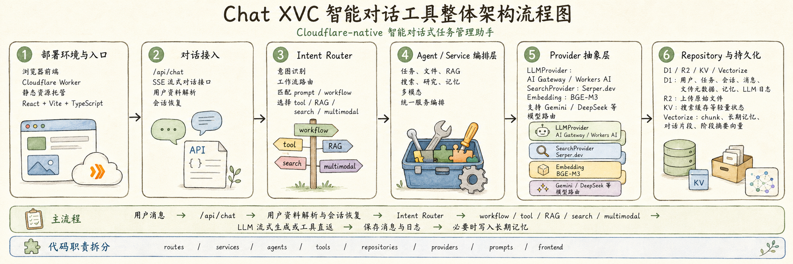
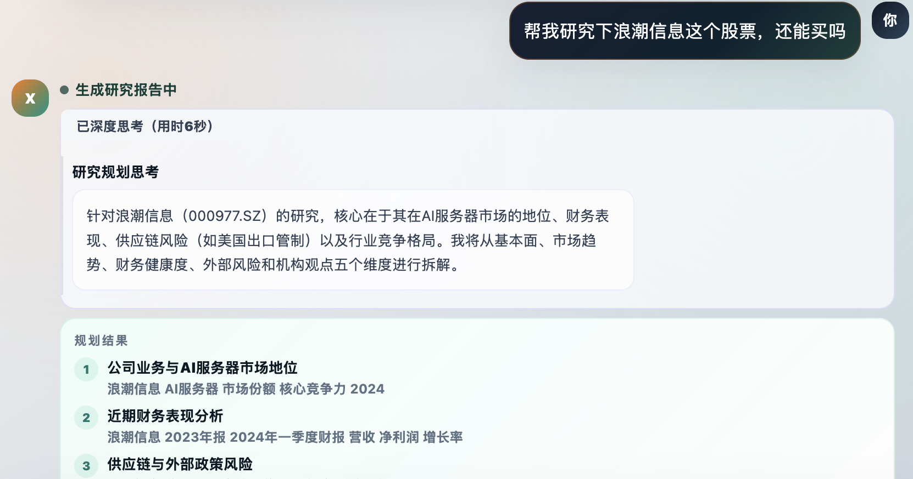
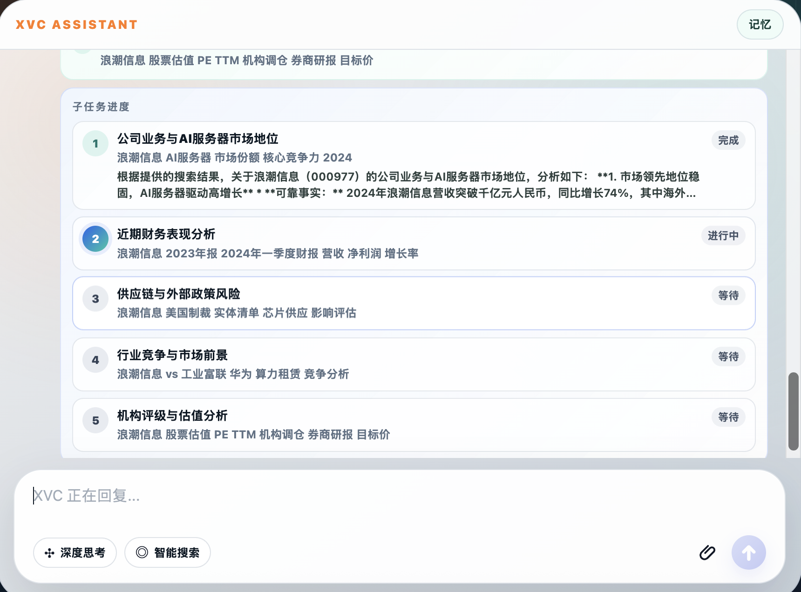
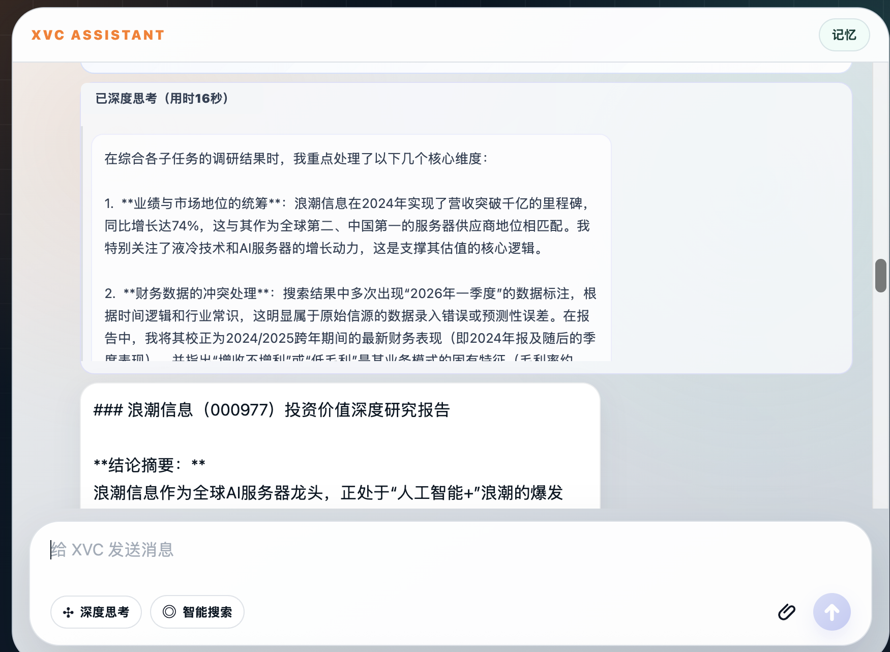
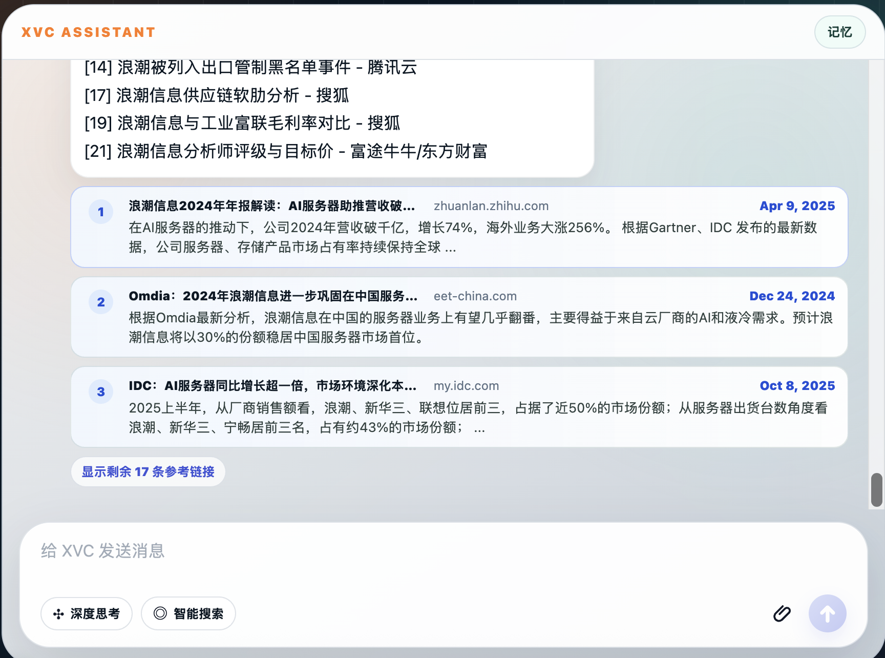
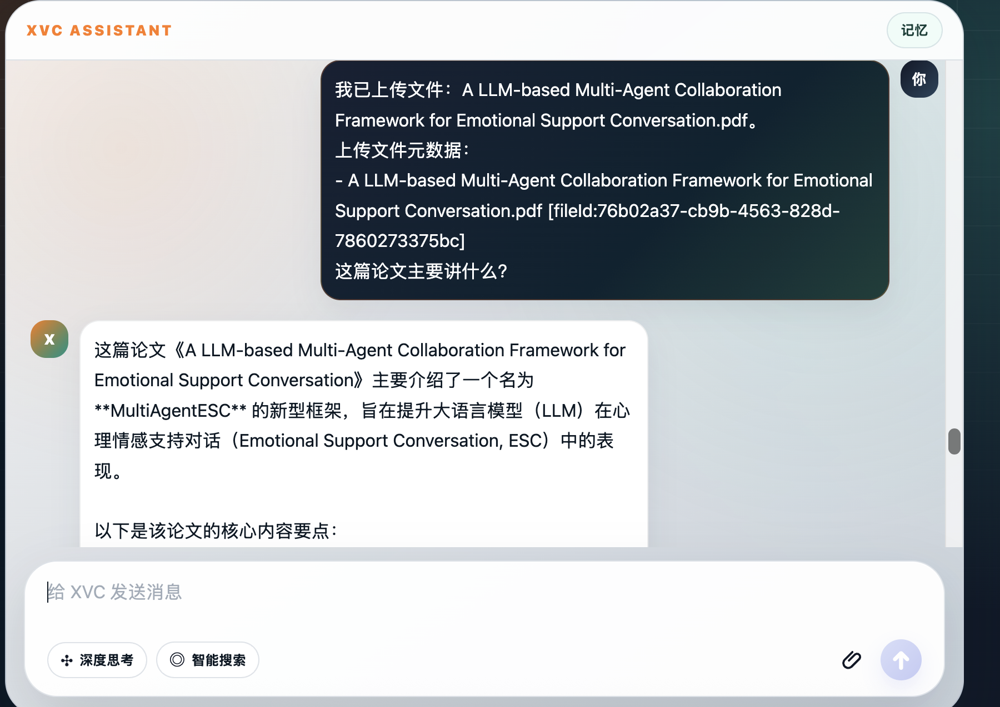
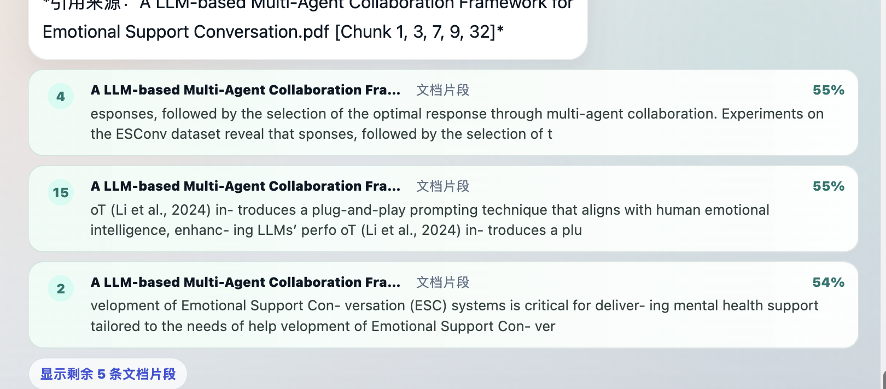
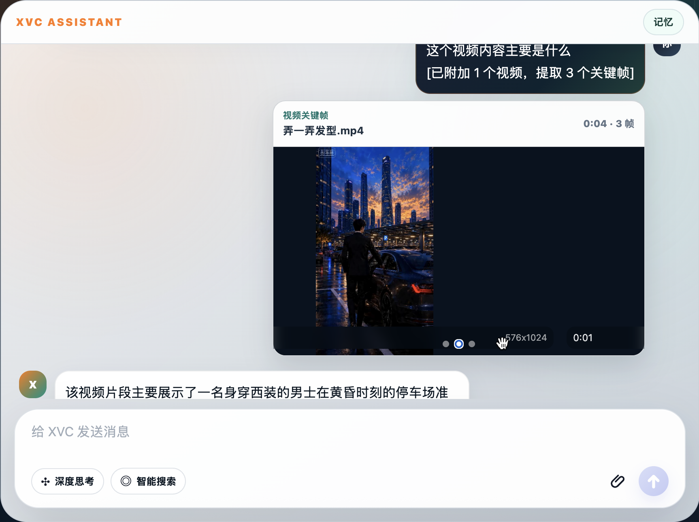
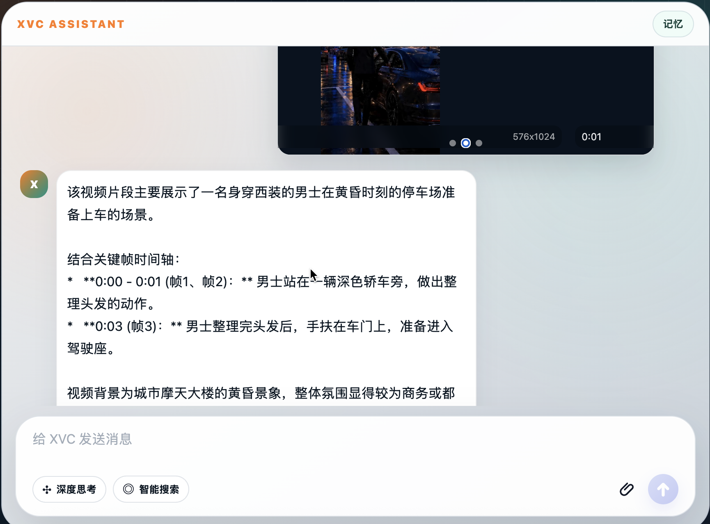

# Chat XVC

# Chat XVC 实现说明

本文档简要说明 Chat XVC 的核心实现方案，重点覆盖整体架构、子代理式研究规划、记忆召回、文件 RAG、多模态能力，以及开发过程中遇到的主要挑战和解决方案。

github:
https://github.com/zhangyunGit/chat_xvc/tree/main

demo:
https://chat-xvc.yun007x.workers.dev/

# 额外说明
1. 首次测试和对话，可能由于边缘服务冷启动较慢，后续应该就正常响应
2. 可以直接在对话说，使用如“清理用户信息”，“重置用户”等自然语言命令进行用户信息重置，以便多次重复测试

# 已支持功能列表
- [x] 任务管理功能
- [x] 文件功能
- [x] 细粒度的意图识别和动态 prompt 切换
- [x] 深度研究和搜索
- [x] 记忆管理功能
- [x] 多模态理解功能

## 资源说明

- Cloudflare Workers `https://chat-xvc.yun007x.workers.dev`
- React + Vite + TypeScript for the formal frontend
- Cloudflare D1
- Cloudflare R2
- Cloudflare KV
- Cloudflare Vectorize
- Cloudflare Workers AI
- Cloudflare AI Gateway(gemini3.1-lite) for chat LLM routing
- DeepSeek as the default chat model provider
- Gemini configured as an alternate chat model provider
- Serper.dev for public web search

## 1. 整体架构

Chat XVC 是一个部署在 Cloudflare Workers 上的智能对话式任务管理助手。整体采用 Cloudflare-native 架构：


```text
浏览器前端
  ↓
Cloudflare Worker
  ├─ 静态资源托管：React + Vite + TypeScript
  ├─ /api/chat：SSE 流式对话接口
  ├─ Intent Router：意图识别与工作流路由
  ├─ Agent / Service 编排层：任务、文件、RAG、搜索、研究、记忆、多模态
  ├─ LLMProvider：Cloudflare AI Gateway / Workers AI 抽象
  ├─ SearchProvider：Serper.dev 抽象
  └─ Repository：D1 / R2 / KV / Vectorize 持久化访问

Cloudflare D1        用户、任务、会话、消息、文件元数据、chunk、记忆、LLM 日志
Cloudflare R2        上传的原始文件
Cloudflare KV        搜索缓存等轻量状态
Cloudflare Vectorize 文档 chunk、长期记忆、对话片段和阶段摘要向量
Workers AI           BGE-M3 embedding
AI Gateway           Gemini / DeepSeek 等聊天模型路由
Serper.dev           外部公开网页搜索
```

代码按职责拆分：

- `routes/`：HTTP 路由和 SSE 响应。
- `services/`：业务流程编排，例如 `ChatService`、`ResearchService`、`RagService`。
- `agents/`：意图路由、规则路由、LLM 路由。
- `tools/`：Agent 可调用动作，如任务工具、搜索工具。
- `repositories/`：D1、R2、Vectorize 等持久化访问。
- `providers/`：LLM、embedding、搜索 provider 抽象。
- `prompts/`：按 intent 选择动态 prompt。
- `frontend/`：React/Vite 聊天工作区。

主流程为：

```text
用户消息
  → /api/chat
  → 用户资料解析与会话恢复
  → Intent Router
  → 对应 workflow / tool / RAG / search / multimodal
  → LLM 流式生成或工具直返
  → 保存消息与日志
  → 必要时写入长期记忆
```

## 2. 子代理规划的具体实现

深度研究通过 `ResearchService` 实现，核心是一个“规划 - 执行 - 汇总”的子代理式工作流。

```text
ResearchPlanner
  ↓ 生成研究目标和子问题
Search Executor
  ↓ 每个子问题调用 Serper.dev
Step Analyzer
  ↓ 分析每个子问题的搜索结果
ResearchSynthesizer
  ↓ 汇总为结构化研究报告
```




具体实现：
1. `ResearchPlanner` 规划拆分子任务(更强的flash模型)->子任务执行(较小的lite模型)->总结子任务结果(更强的flash模型)。默认将问题拆成最多 5 个子任务，每个子任务包含 `title`、`query`、`rationale`。
2. 每个子任务调用 `SearchTools.webSearch`，通过 `SearchProvider` 抽象访问 Serper.dev。
3. `Step Analyzer` 对每个子任务的搜索结果生成 3-5 条要点，区分事实、推断和信息缺口。
4. `ResearchSynthesizer` 去重全局来源，最多取 20 条来源，生成最终 Markdown 报告。
5. 前端通过 SSE 接收 `researchSteps`、`thinkStart`、`thinkDelta`、`thinkDone` 和最终报告流式内容，展示研究进度、可展开思考过程和参考链接。

为了支持多轮指代，深度研究会接收最近对话上下文。当用户说“帮我对它进行深度研究下”时，服务端会先从最近消息中解析“它”指代的对象，再构造明确研究问题，避免把用户姓名等资料误当成研究对象。

## 3. 记忆召回（RAG）的设计与流程

记忆系统由 D1 + Vectorize 组成：

- D1 `memories` 表保存结构化记忆记录。
- Vectorize 保存记忆文本的 embedding。
- Workers AI `@cf/baai/bge-m3` 负责生成 1024 维向量。

记忆分为三类：

- 显式长期记忆：用户明确说“请记住……”“我的偏好是……”。
- 对话片段记忆：普通聊天完成后，将用户输入和助手回复压缩成轻量片段。
- 阶段摘要记忆：每 10/18/26... 轮对话生成最近 10 轮阶段摘要，相邻摘要重叠 2 轮。

召回流程：

```text
用户输入
  → 生成 query embedding
  → Vectorize 按 userId + type 过滤检索
  → D1 回表读取 active memory
  → 合并 explicit memory / conversation_memory / conversation_summary
  → 注入 prompt 的 memory block
  → LLM 基于当前问题和召回记忆回复
```

删除记忆时采用软删除：

- D1 `status` 标记为 `deleted`。
- Vectorize 删除对应向量。
- 查询时只返回 `active` 记忆。

普通对话还会在向量召回为空且用户提到“刚才/之前/我们讨论”时，回退使用最近对话片段，降低 Vectorize 写入可见性延迟带来的漏召回。

## 4. 文件处理与向量化细节

文件能力覆盖上传、存储、解析、分块、embedding、向量写入、检索、摘要、问答和删除。

上传流程：

```text
前端选择/拖拽/粘贴文件
  → POST /api/files multipart/form-data
  → 原文件写入 R2
  → 文件元数据写入 D1 files
  → ctx.waitUntil 后台解析索引
```



支持格式：

- TXT
- Markdown
- JSON
- CSV
- PDF
- DOCX

暂不支持旧版二进制 `.doc`。

解析与分块：

- PDF 使用 `unpdf` 提取文本。
- DOCX 使用 `fflate` 解压并解析 `word/document.xml`。
- Markdown 会保留标题层级作为 `sectionPath`。
- JSON 会转成路径文本，例如 `path: product.requirements[0].title`。
- CSV 会转成按行描述的文本。
- chunk 大小约 200-350 tokens，overlap 约 50-80 tokens。

向量化：

```text
chunk text
  → Workers AI @cf/baai/bge-m3
  → 1024 维 embedding
  → Vectorize upsert
  → D1 document_chunks 保存 chunk 元数据、原文片段、vector_id
```

RAG 检索：

1. 当前问题生成 embedding。
2. Vectorize 语义召回 topK。
3. D1 取回 chunk 内容。
4. 结合关键词候选做轻量融合排序。
5. 对命中 chunk 做相邻 chunk 扩展。
6. 将片段注入文档问答 prompt。

上传后直接问文档内容时，前端会把本轮上传文件的 `fileId` 附加到聊天消息中。后端识别 `[fileId:...]` 后，会短暂等待文件进入 `indexed` 状态；如果 PDF 等文件仍在解析，会明确提示当前状态，而不是直接空检索。

删除文件时会同步处理：

- 删除 R2 原始文件。
- 删除 D1 `document_chunks`。
- 删除 Vectorize 中对应向量。
- D1 `files.status` 标记为 `deleted`。

embedding测试结果
Embedding: cloudflare-workers-ai:@cf/baai/bge-m3
Dataset: C-MTEB/EcomRetrieval
Sampling: targeted qrels positives + random negatives
Candidates: 3000
Evaluated queries: 100

  结果：

  MRR@10:   0.8091
  nDCG@10:  0.8407

  Hit@1:    0.7500
  Recall@1: 0.7500

  Hit@3:    0.8500
  Recall@3: 0.8500

  Hit@5:    0.9100
  Recall@5: 0.9100

  Hit@10:   0.9400
  Recall@10:0.9400

  结论：在这个 100 条中文检索小样本、3000 候选池里，当前记忆向量方案有效性不错：75% 的问题能把正确记忆排到第 1，91% 能进前 5，94% 能进前 10。


## 5. 多模态支持

当前已实现图片、视频关键帧和音频输入。

图片理解 / OCR：

- 前端支持粘贴、拖拽、选择图片。
- 图片以临时 data URL 传入，不写入 R2/D1。
- 后端强制进入图片理解 workflow，不依赖普通意图识别。
- 通过 AI Gateway + Gemini Flash-Lite 处理。
- 日志中只保存脱敏占位，不记录 base64。

视频关键帧理解：

- 前端用 `HTMLVideoElement` + `Canvas` 在浏览器本地抽取关键帧。
- 后端只接收关键帧和时间戳，不上传完整视频。
- 模型基于多张关键帧进行内容理解和 OCR。
- 回复会说明当前判断基于关键帧，而非完整视频播放。




音频转写：

- 支持 MP3、WAV、M4A、AAC、FLAC、OGG、Opus、WebM audio。
- 短音频以内联 base64 方式调用 Gemini 原生 `generateContent`。
- 原始音频不写入 R2/D1，日志只保留脱敏信息。

## 6. 遇到的挑战及解决方案

多轮上下文与意图路由

### 6.1. LLM AI workers和 AI Gateway的选择
为了更好的利用边缘部署的就近调用优势，原计划使用AI Workers作为意图识别和回复生成的LLM，不过实际测试中，除了默认的llama-8BWorker，其他选择AI Workers提供的大多数开源模型（如qwen，glm）在效果和性能上都没有优势，最终改用AI gateway调用gemini3.1-lite模型

### 6.2. 功能分区的设计
本产品涉及到任务管理、文件管理、深度研究。如果是纯PC端，理论上应该利用电脑较大的屏幕做更好的功能分区设计。不过考虑到移动端的兼容性，目前所有功能，全部集成在对话工具界面中。

### 6.3 性能和效果的权衡
细粒度意图识别，使用了规则+LLM，对于任务管理、文件管理的高频话术，建立规则匹配，如果规则未匹配，则使用LLM，这样能够减少LLM调用，减少成本和提升响应速度。
实际测试中，对于任务的删除、修改操作，由于需要指定参数，在自然语言操作的背景下，这类参数通常是指代的，如删除第2个任务，或者非精准匹配的任务名称。此时规则通常导致错误的结果
解决方案：规则只针对创建及列表查询生效，修改删除操作直接使用LLM意图识别（LLM的多轮理解能力更强）


## 功能测试
功能冒烟测试位于 `scripts/feature-*.mjs`。这些脚本面向核心业务流程，不依赖真实 Cloudflare D1、R2、Vectorize 或外部 LLM 服务。脚本会在临时目录中用 `esbuild` 打包对应服务模块，并使用本地 mock 资源执行可重复测试。

### 1.1 统一运行

```bash
npm run test:features
```

该命令依次运行：

```bash
npm run test:feature:tasks
npm run test:feature:files
npm run test:feature:memory
npm run test:feature:research
```

最近一次验证结果：

```text
feature task management ok
feature file management ok
feature memory management ok
feature deep research ok
```

### 1.2 任务管理冒烟测试

脚本：

```text
scripts/feature-task-management.mjs
```

运行：

```bash
npm run test:feature:tasks
```

覆盖范围：

- 创建任务。
- 列出任务。
- 使用 `targetIndex` 按“第几个任务”修改任务。
- 给指定任务补充需求。
- 使用序号完成任务。
- 使用序号删除任务。
- 验证最终任务列表状态。

重点验证的问题：

- 多轮对话中常见的“把第 2 个删除掉”“把第 2 个完成掉”等指代型操作，能够通过 LLM 意图识别结果中的 `targetIndex` 被服务层正确执行。
- 测试使用本地 mock D1，不写真实数据库。

### 1.3 文件管理冒烟测试

脚本：

```text
scripts/feature-file-management.mjs
```

运行：

```bash
npm run test:feature:files
```

覆盖范围：

- 上传 Markdown 文件。
- 写入 mock R2。
- 写入文件元数据。
- 调用文档处理服务解析、切片、生成 embedding、写入 mock Vectorize。
- 列出文件。
- 删除文件。
- 删除时清理 mock R2 对象、document chunk 和向量。

重点验证的问题：

- 文件上传、解析、向量化和删除清理形成闭环。
- 测试使用本地 mock R2、mock D1、mock Vectorize，不写真实 Cloudflare 资源。

### 1.4 记忆管理冒烟测试

脚本：

```text
scripts/feature-memory-management.mjs
```

运行：

```bash
npm run test:feature:memory
```

覆盖范围：

- 显式记忆写入。
- 对话片段记忆写入。
- 显式记忆和对话记忆混合召回。
- 列出记忆。
- 按主题删除记忆。
- 删除时清理对应向量。

重点验证的问题：

- `MemoryService` 的写入、召回、列表和删除流程可正常工作。
- 记忆向量使用 `type=memory`，对话片段使用 `type=conversation_memory`，召回时可按类型过滤。
- 测试使用本地 mock D1 和 mock Vectorize，不写真实资源。

### 1.5 深度研究冒烟测试

脚本：

```text
scripts/feature-deep-research.mjs
```

运行：

```bash
npm run test:feature:research
```

覆盖范围：

- 深度研究 planner 生成研究计划。
- 每个子任务调用 mock web search。
- 每个子任务调用 LLM 分析。
- 最终 synthesis 生成研究报告。
- 流式 thinking UI 事件输出。
- 研究步骤 UI 状态从 pending 到 active/success。
- 指代解析回归：用户说“帮我对它进行深度研究下”时，应从最近上下文解析为“浪潮信息（000977.SZ）”，不能误识别为用户姓名。

重点验证的问题：

- 深度研究 workflow 的 planner、search、step analysis、synthesis 能形成完整链路。
- 测试使用 mock LLM 和 mock fetch，不访问真实搜索服务或模型。

## 2. 记忆召回评估

记忆召回评估脚本：

```text
scripts/eval-memory-retrieval.mjs
```

package 命令：

```bash
npm run eval:memory-retrieval
```

该脚本用于评估当前记忆向量方案的检索效果。它复用项目里的 `MemoryService.recall` 逻辑，但向量索引使用脚本内存 mock，因此不会写入真实 Cloudflare Vectorize，也不会污染 D1 或用户记忆。

### 2.1 数据集

默认数据集：

```text
C-MTEB/EcomRetrieval
C-MTEB/EcomRetrieval-qrels
```

用途：

- `corpus` 作为候选记忆内容。
- `queries` 作为用户查询。
- `qrels` 作为标准答案。

当前脚本支持两种抽样方式：

- `targeted`：先按 qrels 选择 query 和正例文档，再补充随机负例到指定候选规模。默认方式。
- `prefix`：直接读取前 N 条 corpus，再筛选落在候选池内的 qrels。适合快速调试，但可能凑不满指定 query 数。

由于当前环境访问 `datasets-server.huggingface.co` 不稳定，脚本已实现 fallback：当 datasets-server 失败时，自动从 Hugging Face 原始 parquet 文件下载，并通过本地 `pyarrow` 读取。

### 2.2 运行方式

离线 smoke test，不访问 Hugging Face 或 Cloudflare：

```bash
npm run eval:memory-retrieval -- --offline-smoke --queries 4 --candidates 5 --embedding hash --vector-dimensions 256
```

真实小样本评估，使用当前 Cloudflare Workers AI embedding：

```bash
npm run eval:memory-retrieval -- --queries 100 --candidates 3000 --embedding cloudflare
```

Cloudflare embedding 模式需要：

```text
CLOUDFLARE_API_TOKEN
```

`CLOUDFLARE_ACCOUNT_ID` 可以来自环境变量，也可以来自项目根目录 `config.json` 的：

```json
{
  "cloudflare": {
    "account_id": "..."
  }
}
```

### 2.3 最近一次评估配置

执行时间：

```text
2026-05-18
```

配置：

```text
Dataset: C-MTEB/EcomRetrieval
Embedding: cloudflare-workers-ai:@cf/baai/bge-m3
Sampling: targeted qrels positives + random negatives
Candidates: 3000
Evaluated queries: 100
Positive documents included: 100
Random negative documents included: 2900
Full corpus rows loaded locally: 100902
```

说明：

- 这次评估没有写入真实 Vectorize。
- 3000 条候选向量只存在于脚本内存 mock Vectorize 中。
- 进程结束后向量自动消失。
- 结果是 sampled candidate pool 上的指标，不是完整 C-MTEB 官方全量 corpus 指标。

### 2.4 最近一次评估结果

```text
MRR@10:   0.8091
nDCG@10:  0.8407

K=1
Hit@1:       0.7500
Recall@1:    0.7500
Precision@1: 0.7500

K=3
Hit@3:       0.8500
Recall@3:    0.8500
Precision@3: 0.2833

K=5
Hit@5:       0.9100
Recall@5:    0.9100
Precision@5: 0.1820

K=10
Hit@10:       0.9400
Recall@10:    0.9400
Precision@10: 0.0940
```

示例输出：

```text
200115: firstRelevantRank=1 relevant=121065 retrieved=121065,23431,82461,9555,19863
  border饼干
200398: firstRelevantRank=1 relevant=401485 retrieved=401485,1830,27861,23439,95955
  自动喂食器 鱼
200003: firstRelevantRank=1 relevant=4836 retrieved=4836,79557,25167,111,32873
  启辰r50大灯罩
```


## 部署

```bash
npm install
cp config.example.json config.json
export CLOUDFLARE_API_TOKEN="your-scoped-api-token"
export DEEPSEEK_API_KEY="your-deepseek-api-key"
export GEMINI_API_KEY="your-gemini-api-key"
```

Fill `config.json` with your Cloudflare account information.

## Provision Cloudflare

```bash
npm run cf:provision
npm run cf:sync-secrets
npm run cf:migrate:remote
```

See `scripts/bootstrap-new-cloudflare-account.md` for the full reproducible setup flow.
Provisioning creates an account-specific `wrangler.generated.jsonc` from the committed `wrangler.jsonc` template.

The default chat model is routed through Cloudflare AI Gateway:

- Gateway ID: `deepseek_falsh`
- Default provider/model: `google-ai-studio/gemini-3.1-flash-lite`
- Deep thinking model: `google-ai-studio/gemini-3-flash-preview`
- Legacy alternate provider/model: `deepseek/deepseek-v4-flash`
- Image understanding/OCR model: `google-ai-studio/gemini-3.1-flash-lite`
- Video keyframe understanding model: `google-ai-studio/gemini-3.1-flash-lite`
- Audio transcription model: `gemini-3.1-flash-lite`

## LLM Call Logging

The Worker writes request-level AI trace records to D1 table `llm_call_logs` when `LLM_LOGGING_ENABLED` is enabled.

Current behavior:

- Each `/api/chat` request gets a `requestId`, returned in the SSE `meta` event.
- All AI-related stages in that request share the same `request_id`.
- Rule and forced intent routing also write a trace row, with `provider=rule` and `model_name=rule`, so a request with rule routing still has an intent-stage log.
- LLM intent routing, profile extraction, reply generation, deep research planning/step analysis/synthesis, and conversation stage summaries write separate rows with `stage`, `intent`, `provider`, `model_name`, `status`, and optional `duration_ms` / `error_text`.
- If intent routing or reply generation throws before a normal response is available, the Worker writes `intent.error` or `reply.error` with `status=error` and `error_text`.

Useful stages include:

```text
intent.rule
intent.llm
intent.forced_web_search
intent.forced_deep_research
profile.intake
profile.update
reply.general
reply.web_answer
reply.memory_recall
reply.document_summary
reply.document_qa
reply.task_tool_result
research.plan
research.step_analysis.{n}
research.synthesis
memory.stage_summary
intent.error
reply.error
```

Logging switch:

```jsonc
"LLM_LOGGING_ENABLED": "true"
```

Set it to `false`, `0`, `off`, `no`, or `disabled` to skip writing `llm_call_logs`.

Example D1 lookup:

```sql
SELECT called_at, request_id, stage, intent, provider, model_name, status
FROM llm_call_logs
WHERE request_id = '...'
ORDER BY called_at, created_at;
```

## Development

```bash
npm run dev
```

For frontend-only Vite development:

```bash
npm run dev:frontend
```

For a production frontend build served by the Worker assets binding:

```bash
npm run build:frontend
```

## File Upload

The frontend attachment button, paste, and drag-and-drop flows upload files to:

```text
POST /api/files
```

Upload behavior:

- Request type: `multipart/form-data`
- Fields: `userId` optional, `files` repeated
- Limit: up to 12 files per request, 25 MB per file
- Raw files are stored in Cloudflare R2 under `users/{userId}/files/...`
- File metadata is persisted in D1 table `files`
- Files are indexed asynchronously with Workers AI `@cf/baai/bge-m3` and Vectorize. Supported indexing formats currently include TXT, Markdown, JSON, CSV, PDF, and DOCX.
- Legacy binary `.doc` files are not indexed; upload `.docx` instead.
- Indexed files can be searched, summarized, and used for document Q&A through chat intents such as `document.search`, `document.summarize`, and `document.qa`.
- In the common flow where a user drags a file into the chat box and says "请总结该文档内容", the frontend uploads the file first, attaches the returned file id to the chat message, and the backend routes the request to `document.summarize`.
- Summary requests wait briefly for asynchronous indexing to finish. If the file is still processing, the assistant asks the user to retry after a few seconds.

List uploaded files:

```text
GET /api/files?userId={userId}
```

Delete an uploaded file and its indexed data:

```text
DELETE /api/files/{fileId}?userId={userId}
```

Deletion removes the R2 object, deletes `document_chunks`, deletes the corresponding Vectorize vectors, and marks the D1 `files` row as `deleted`.

Current file/RAG capability status:

- Complete: upload, R2 raw-file storage, D1 metadata, asynchronous parsing, chunking, BGE-M3 embedding, Vectorize storage, file listing, explicit UI deletion, document search, document Q&A, adjacent chunk expansion, and upload-to-summary linkage.
- Supported indexing formats: TXT, Markdown, JSON, CSV, PDF, DOCX.
- Not supported: legacy binary `.doc`; upload `.docx` instead.
- Current summary limit: single-file direct summary over the first 24 chunks. Long-document hierarchical summary is still pending.
- Pending RAG improvements: parent section expansion and reranker-based second-stage ranking.

## External Search

Research intents use the `SearchProvider` abstraction with Serper.dev as the default provider.

Configuration:

```bash
export SERPER_API_KEY="your-serper-api-key"
npm run cf:sync-secrets
```

Current behavior:

- Research intents such as `research.quick_search`, `research.latest_info`, `research.fact_check`, `research.compare_options`, and `research.deep_report` trigger external web search.
- Selecting "智能搜索" in the chat composer sends `forceWebSearch: true`, so the message defaults to the external search workflow even if the text itself is ambiguous.
- Selecting "深度思考" in the chat composer sends `forceDeepResearch: true`, so the message defaults to the deep research workflow even if the text itself is ambiguous.
- Search results are cached in Cloudflare KV for 15 minutes.
- Search results are passed into the research prompt and returned to the frontend as `ui.webResults`.
- The frontend renders web sources as clickable external result cards. By default it shows 3 links and provides a lightweight button to reveal the remaining references.
- If the search provider fails or the secret is missing, the assistant gives a clear user-facing failure message instead of silently answering without search results.

Current limitations:

- Deep research is currently enabled for `research.deep_report`; compare and fact-check intents still use the simpler single-search flow.

## Long-Term Memory

The `memory` branch adds the first version of user-controlled long-term memory.

Current behavior:

- Explicit memory writes are supported through messages such as "请记住：我喜欢简洁的回答" or "我的偏好是先给结论再解释".
- Memories are persisted in D1 table `memories`.
- Memory embeddings use Workers AI `@cf/baai/bge-m3` and the existing Vectorize index.
- Memory vectors use metadata `type=memory`, so they can be retrieved separately from document chunks.
- Memory vector ids use `memory:{memoryId}` to stay under Vectorize id length limits; user scoping is enforced through vector metadata and D1 rows.
- General chat and small talk also persist a lightweight conversation snippet memory with vector id `cmem:{memoryId}` and metadata `type=conversation_memory`.
- Conversation snippets are embedded from the compacted original user/assistant turn.
- Every conversation creates a stage summary after completed assistant turns 10, 18, 26, and so on. Each summary covers the latest 10 turns, so adjacent summaries overlap by 2 turns.
- Stage summaries use vector id `csum:{memoryId}` and metadata `type=conversation_summary`; their embeddings are generated from the LLM summary text, not the raw 10-turn transcript.
- General chat and small talk recall explicit memories, relevant conversation snippets, and stage summaries, then inject them into the prompt as a memory/context block.
- Follow-up questions such as "刚才提到的项目叫什么" fall back to recent conversation snippets when vector recall returns no match.
- Explicit recall questions use the recalled memory/context block to generate a natural answer instead of only dumping the raw memory list.
- Users can ask what is remembered, recall related memories, or delete memories by topic.
- The chat header includes a "记忆" management panel for listing, refreshing, and deleting individual memories.

Memory management API:

```text
GET /api/memories?userId={userId}
DELETE /api/memories/{memoryId}?userId={userId}
```

First-stage limits:

- Explicit preference/fact/instruction memory writing is still user-controlled; automatic storage is limited to compact conversation snippets for general chat and small talk.
- Delete-by-topic is implemented, but low-confidence deletion confirmation is still pending.
- Stage summary generation currently runs synchronously on the trigger turn; moving it to `ctx.waitUntil` is still pending.
- Conversation snippets and stage summaries do not yet deduplicate semantically similar memories.
- The memory panel is intentionally lightweight; category filters, search, and bulk operations are pending.

## Deep Research

The `research` branch adds a first version of the deep research workflow for `research.deep_report`.

Model routing:

- Planner: configured as `gemini-3-flash-preview` through Google AI Studio
- Per-subtask analysis: configured as `gemini-3-flash-preview` through Google AI Studio
- Final synthesis: configured as `gemini-3-flash-preview` through Google AI Studio
- Gemini pro is configured for later use as `google-ai-studio/gemini-3.1-pro-preview`

Workflow:

- Plan the research objective and 3-5 search subtasks.
- Run external search for each subtask.
- Analyze each subtask with the default fast model.
- Deduplicate sources and synthesize a structured report with the pro model.
- Stream progress updates to the frontend as `ui.researchSteps`.
- Stream user-visible planner and synthesis thinking into ChatUI `Think` components with `thinkStart`, `thinkDelta`, and `thinkDone` UI events.
- The streamed Think content is field-filtered from the model JSON `thinking` value; planning steps and final report content are parsed server-side but not streamed into the Think panel.
- Research messages render in workflow order: planner thinking, plan summary, subtask progress, synthesis thinking, final report, and web references. The chat log auto-scrolls as these sections update, and each subtask can be clicked to expand its full content.
- Long Think content is rendered with ChatUI `Bubble` inside `Think`, with a bounded scroll area and the native Think collapse toggle.

## Deploy

```bash
npm run cf:deploy
```

`cf:deploy` builds the React/Vite frontend into `dist/client` before deploying the Worker.

## Documentation

- `readme.txt`: original assignment.
- `LOGGING_FEATURE_PROGRESS.md`: current LLM request trace logging design and verification notes.
- `MEMORY_FEATURE_PROGRESS.md`: current memory-system progress and next steps.
- `MULTIMODAL_FEATURE_PROGRESS.md`: current image/OCR, video keyframe, and audio transcription design and verification notes.
- `PROJECT_PLAN.md`: requirements, architecture, and implementation plan.
- `ARCHITECTURE.md`: code layering, module responsibilities, and call-flow design.
- `INTENT.md`: fine-grained intent registry and Intent Router implementation plan.
- `AGENTS.md`: coding-agent rules for this repository.
- `skills/frontend-design/SKILL.md`: frontend design direction and UI quality rules.
